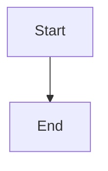

# Design: [Feature Name]

## Overview

## Architecture

### Technology Choices
- **Backend**:
- **Database**:
- **Frontend**:
- **Other**:

### Components
- **Component Name**:
-

## Data Model

```typescript
interface EntityName {
  id: string;          // UUID, primary key
  field: string;       // required, unique
  anotherField: number;
  createdAt: Date;
}
```

**Relationships:**
- Describe how entities relate

**Indexes:**
- List fields that need indexing

## API Contracts

### Endpoint Name
- **Method**:
- **Path**:
- **Request**:
- **Response**:
- **Errors**:

## User Interface

### Screens Overview
**Figma Reference**: [Design Name](https://figma.com/file/...)

### Screen: [Screen Name]

**Layout Structure:**
-
-

**Components:**
- `ComponentName`:
  - `ChildComponent`:
  - `ChildComponent`:
-

**States:**
- Default:
- Loading:
- Error:
- Success:

**Interactions:**
1.
2.

### User Flows



## Security Considerations
-
-

## Performance Considerations
-
-

## Error Handling
-
-

## Architecture Decisions

- ✅ [Approach/Option]: [Description]
  - **Pros**: [...]
  - **Cons**: [...]
  - [Rationale]

- ❌ [Approach/Option]: [Description]
  - **Pros**: [...]
  - **Cons**: [...]
  - [Rationale]

### Trade-offs & Compromises
-
-

## Migration Strategy

### Steps
1.
2.

### Rollback Plan
-

## Open Issues
- [ ]
- [ ]
